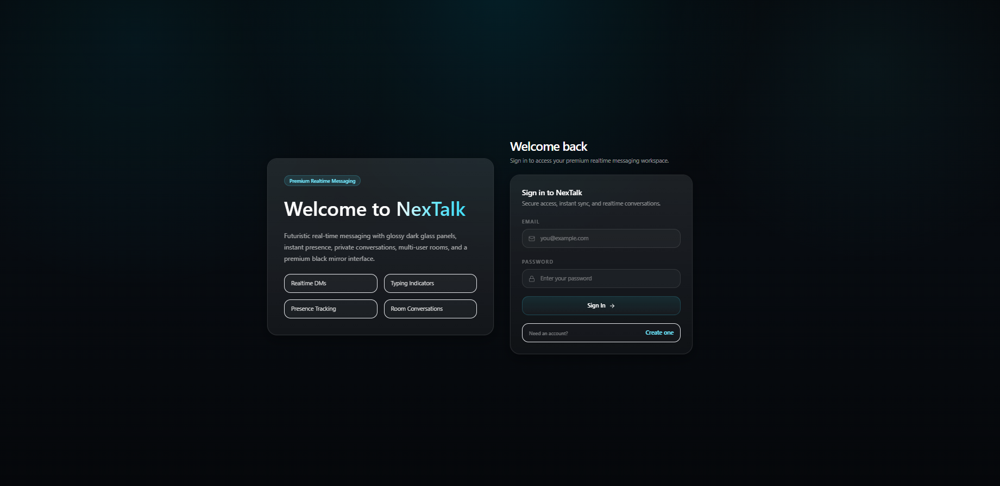
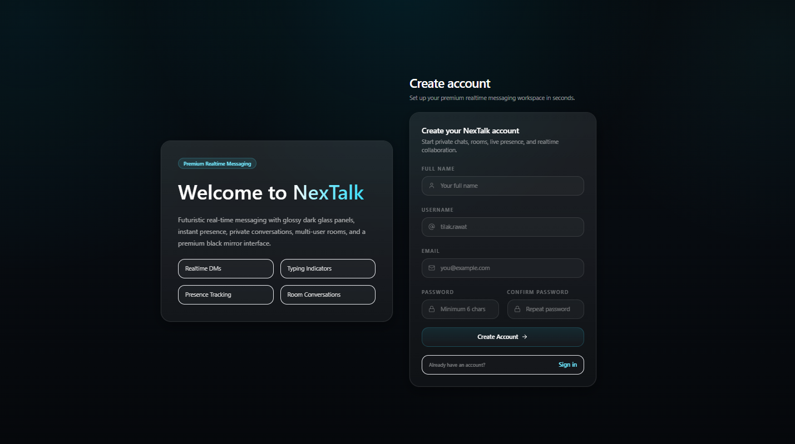
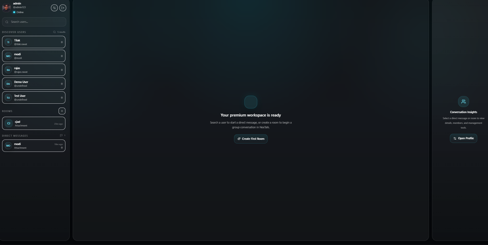
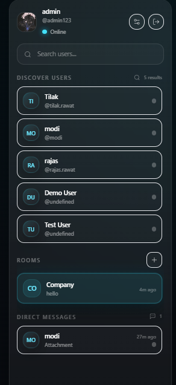
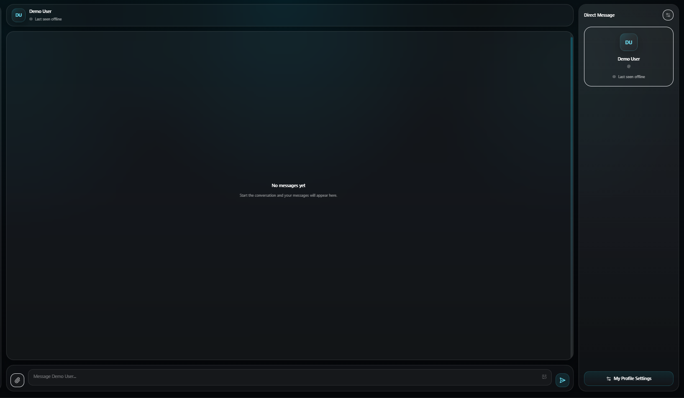
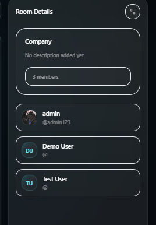
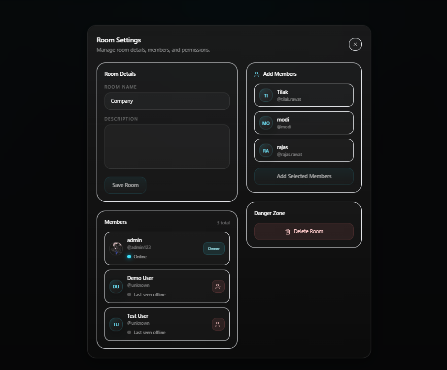
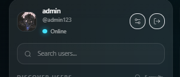

# 💬 NexTalk — Premium Real-Time Chat Platform

NexTalk is a **full-stack real-time messaging platform** built with a modern React + Node.js architecture and a premium dark glass UI.

It supports **JWT authentication**, **private 1-to-1 messaging**, **multi-user chat rooms**, **real-time Socket.IO delivery**, **typing indicators**, **live presence**, **file/image sharing**, **profile management**, and **room member administration**.

---

## ✨ Highlights

- 🔐 JWT auth with persistent sessions
- 💬 Real-time direct messaging
- 👥 Multi-user chat rooms
- ⚡ Socket.IO powered live delivery
- ⌨️ Typing indicators for DMs and rooms
- 🟢 Presence + last seen tracking
- 📎 Image & file uploads with preview support
- 🧑 Profile settings (name, username, bio, avatar)
- 🛠️ Room management (edit room, add/remove members, delete/leave room)
- 🎨 Premium futuristic dark “black mirror” UI

---

## 🖼️ Screenshots

### Login Page


### Register Page


### Main Dashboard


### Sidebar Navigation & User Discovery


### Active Chat Interface


### Room Info Panel


### Room Settings & Member Management


### Sidebar Profile Header


---

## 🚀 Features

### 🔐 Authentication
- User registration
- User login
- JWT-based protected routes
- Persistent auth state on refresh
- Current user endpoint (`/api/auth/me`)

### 💬 Direct Messaging
- Private 1-to-1 conversations
- Message history loading
- Real-time delivery with Socket.IO
- Typing indicators
- File/image attachments

### 👥 Rooms / Group Chat
- Create rooms
- Join rooms
- Leave rooms
- View room message history
- Room membership validation
- Edit room details (creator only)
- Add members to existing rooms
- Remove members from rooms
- Delete room (creator only)

### 🧑 Profile & Account
- View current profile
- Update name
- Update username
- Update bio
- Upload/change avatar
- Delete account

### 📎 File Sharing
- Upload images and documents
- File type validation
- Max file size validation
- File previews in chat UI
- Static serving from `/uploads`

### 🟢 Presence & Realtime UX
- Online / offline status
- Last seen timestamps
- Typing indicators for DMs and rooms
- Real-time room update sync events

---

## 🏗️ Tech Stack

### Frontend (`client/`)
- React + Vite
- Tailwind CSS
- React Router DOM
- Axios
- Socket.IO Client
- Lucide React

### Backend (`backend/`)
- Node.js
- Express
- Socket.IO
- MongoDB + Mongoose
- JWT
- bcrypt
- Multer
- Helmet
- Morgan
- CORS

---

## 📂 Project Structure

```bash
NexTalk/
├── backend/
│   ├── src/
│   │   ├── config/
│   │   │   └── db.js
│   │   ├── controllers/
│   │   │   ├── auth.controller.js
│   │   │   ├── message.controller.js
│   │   │   ├── room.controller.js
│   │   │   ├── upload.controller.js
│   │   │   └── user.controller.js
│   │   ├── middleware/
│   │   │   ├── asyncHandler.js
│   │   │   ├── auth.middleware.js
│   │   │   ├── error.middleware.js
│   │   │   └── notFound.middleware.js
│   │   ├── models/
│   │   │   ├── Message.js
│   │   │   ├── Room.js
│   │   │   └── User.js
│   │   ├── routes/
│   │   │   ├── auth.routes.js
│   │   │   ├── message.routes.js
│   │   │   ├── room.routes.js
│   │   │   ├── upload.routes.js
│   │   │   └── user.routes.js
│   │   ├── socket/
│   │   │   ├── authSocket.js
│   │   │   ├── events.js
│   │   │   ├── index.js
│   │   │   └── presence.js
│   │   ├── utils/
│   │   ├── validators/
│   │   └── app.js
│   ├── uploads/
│   ├── .env
│   ├── package.json
│   └── server.js
│
├── client/
│   ├── src/
│   │   ├── components/
│   │   ├── context/
│   │   ├── hooks/
│   │   ├── layouts/
│   │   ├── lib/
│   │   ├── pages/
│   │   ├── routes/
│   │   └── styles/
│   ├── .env
│   ├── package.json
│   └── vite.config.js
│
├── docs/
│   ├── chat-interface.png
│   ├── dashboard-main.png
│   ├── dashboard-sidebar.png
│   ├── login-page.png
│   ├── register-page.png
│   ├── room-info-panel.png
│   ├── room-settings-management.png
│   └── sidebar-profile-header.png
│
└── README.md
````

---

## ⚙️ Environment Variables

> **Important:** Never commit real secrets to GitHub.
> Replace your current `.env` values with your own secure values before pushing publicly.

### Backend — `backend/.env`

```env
PORT=5000
NODE_ENV=development

MONGO_URI=your_mongodb_connection_string
JWT_SECRET=your_secure_random_jwt_secret
JWT_EXPIRES_IN=7d

CLIENT_URL=http://localhost:5173

MAX_FILE_SIZE_MB=10
UPLOAD_DIR=uploads
```

### Frontend — `client/.env`

```env
VITE_API_URL=http://localhost:5000/api
VITE_SERVER_URL=http://localhost:5000
```

---

## 🧪 Local Setup

### 1) Clone the repository

```bash
git clone https://github.com/your-username/NexTalk.git
cd NexTalk
```

### 2) Setup backend

```bash
cd backend
npm install
```

Create `backend/.env`:

```env
PORT=5000
NODE_ENV=development

MONGO_URI=your_mongodb_connection_string
JWT_SECRET=your_secure_random_jwt_secret
JWT_EXPIRES_IN=7d

CLIENT_URL=http://localhost:5173

MAX_FILE_SIZE_MB=10
UPLOAD_DIR=uploads
```

Run backend:

```bash
npm run dev
```

Backend runs on:

```bash
http://localhost:5000
```

### 3) Setup frontend

```bash
cd ../client
npm install
```

Create `client/.env`:

```env
VITE_API_URL=http://localhost:5000/api
VITE_SERVER_URL=http://localhost:5000
```

Run frontend:

```bash
npm run dev
```

Frontend runs on:

```bash
http://localhost:5173
```

---

## 📡 REST API Overview

### Auth

* `POST /api/auth/register`
* `POST /api/auth/login`
* `GET /api/auth/me`

### Users

* `GET /api/users?q=&limit=20`
* `GET /api/users/me/profile`
* `PATCH /api/users/me/profile`
* `PATCH /api/users/me/avatar`
* `DELETE /api/users/me`

### Rooms

* `GET /api/rooms`
* `POST /api/rooms`
* `POST /api/rooms/:roomId/join`
* `POST /api/rooms/:roomId/leave`
* `PATCH /api/rooms/:roomId`
* `POST /api/rooms/:roomId/members`
* `DELETE /api/rooms/:roomId/members/:memberId`
* `DELETE /api/rooms/:roomId`

### Messages

* `GET /api/messages/threads`
* `GET /api/messages/dm/:userId`
* `GET /api/messages/room/:roomId`

### Upload

* `POST /api/upload`

### Health Check

* `GET /api/health`

---

## 🔌 Socket.IO Events

### Client → Server

* `room:join`
* `room:leave`
* `dm:send`
* `room:send`
* `dm:typing`
* `room:typing`

### Server → Client

* `server:ready`
* `dm:new`
* `room:new`
* `dm:typing`
* `room:typing`
* `presence:update`
* `presence:sync`
* `room:updated`
* `socket:error`

---

## 🧠 Data Models

### User

* `name`
* `username`
* `email`
* `password`
* `bio`
* `avatar`
* `isOnline`
* `lastSeen`

### Room

* `name`
* `description`
* `members`
* `createdBy`

### Message

* `sender`
* `receiver` (for DMs)
* `room` (for room messages)
* `content`
* `fileUrl`
* `fileType`
* `createdAt`
* `updatedAt`

---

## 🎨 UI / Design System

NexTalk uses a custom **premium dark glassmorphism** design language inspired by futuristic AI dashboards:

* Deep black / charcoal surfaces
* Glassy layered panels
* Cyan neon accent glow
* Soft borders and subtle reflections
* Rounded 2xl/3xl cards
* Premium dark inputs and buttons
* Responsive chat layout with sidebar + main panel + info panel

Reusable UI building blocks include:

* `GlassCard`
* `GlassInput`
* `GlassButton`
* `UserAvatar`
* `StatusBadge`
* `ChatHeader`
* `Composer`
* `MessageBubble`
* `TypingIndicator`
* `ProfileSettingsModal`
* `RoomSettingsModal`

---

## 🔒 Security & Validation

* Passwords hashed using `bcrypt`
* JWT-protected REST endpoints
* JWT-authenticated Socket.IO connections
* Room membership checks for room history and room messaging
* Creator-only room edit / member management / delete controls
* File type validation for uploads
* File size limits enforced with Multer
* Error middleware + not found middleware for consistent API responses

---

## 🛠️ Future Improvements

Possible next upgrades:

* Message read receipts
* Delivered / seen indicators
* Emoji picker
* Message reactions
* Edit / delete messages
* Cloud storage (Cloudinary / S3) instead of local uploads
* Notifications / sound alerts
* Unread badge counts
* Infinite scroll pagination
* Typing participant names in rooms
* Docker + CI/CD deployment

---

## 🌍 Deployment Recommendation

Recommended production stack:

* **Frontend:** Vercel
* **Backend:** Render or Railway
* **Database:** MongoDB Atlas

### Production env example

#### Backend

```env
PORT=5000
NODE_ENV=production
MONGO_URI=your_mongodb_atlas_uri
JWT_SECRET=your_secure_random_jwt_secret
JWT_EXPIRES_IN=7d
CLIENT_URL=https://your-frontend-domain.vercel.app
MAX_FILE_SIZE_MB=10
UPLOAD_DIR=uploads
```

#### Frontend

```env
VITE_API_URL=https://your-backend-domain.onrender.com/api
VITE_SERVER_URL=https://your-backend-domain.onrender.com
```

---

## 📌 Notes

* Uploaded files are currently stored on local disk (`/uploads`) and served statically.
* For production-scale deployment, migrating uploads to **Cloudinary** or **AWS S3** is recommended.
* If deploying publicly, make sure to:

  * remove real secrets from `.env`
  * add `.env` to `.gitignore`
  * rotate any exposed credentials if they were ever committed

---

## 👨‍💻 Author

**Tilak Raj Rawat**
GitHub: [github.com/Tilakrajrawat](https://github.com/Tilakrajrawat)
LinkedIn: [linkedin.com/in/tilakrajrawat142](https://in.linkedin.com/in/tilakrajrawat142)

---

## 📜 License

This project is licensed under the **MIT License**.

---

## ⭐ If you like this project

If this project helped or inspired you, consider starring the repository.
